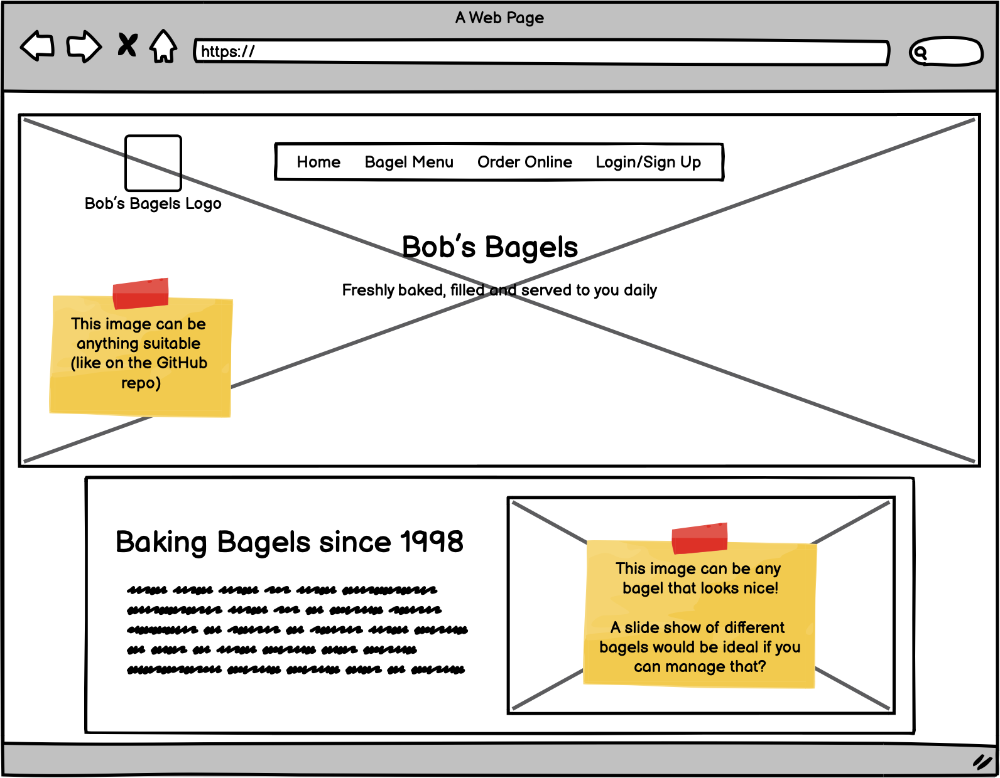

# Bob's Bagels - E-commerce Pair Programming Activity

## Bob needs your help again

After your sterling work creating the basket system for Bob's Bagels, you've managed to land some more work with him!

This time he'd like you to start to create a website for him - nothing fancy, just using simple HTML/CSS/JavaScript!  (You are allowed to use Bootstrap!)

---

### Requirement 1

As a user, I'd like to see a landing page when I get to Bob's Bagels home page, so that I can see some information about Bob's Bagels and navigate to other areas of the site

---

### Requirement 2

As a user, on the landing page, I'd like to see a slide-show of bagel images so that I can see what products they sell

---

### Requirement 3

As a user, I'd like the site to display nicely on my mobile phone, so that I can use it on the go

---

## Design and Layout

Bob's other friend, Daisy, a UX/UI designer, has created a wireframe of the site and this is what Bob wants you to use as a basis for the site.

---

## Other Assets

For the time being, until Bob has worked out how to use the camera on his phone to take pictures of his own delicious bagels, he's asked you to source some images for the site.  There's no real restrictions, as they will be replaced, but if they can be of bagels and fit into the space nicely, that would be great!
